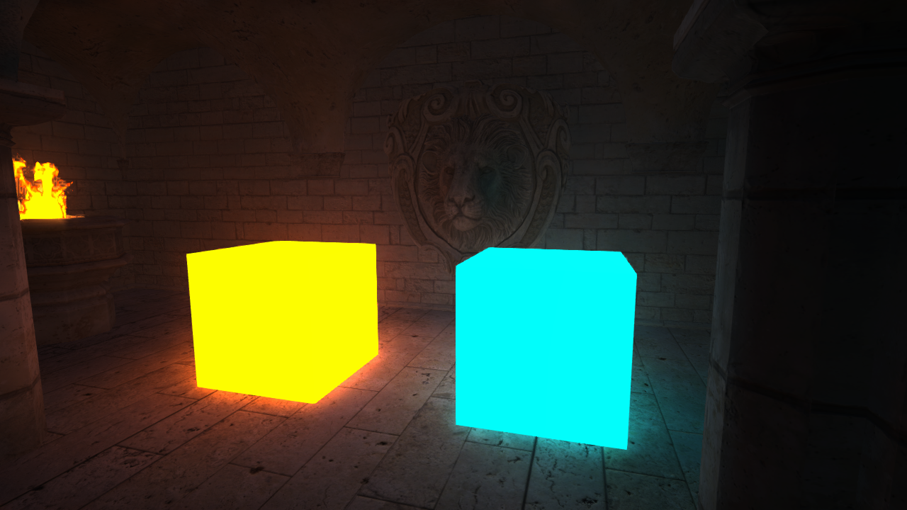

Poor GI
===

A basic implementation of Screen Space Global Illumination (SSGI) for Unity URP.

Core Approach
-------------
- Low-resolution processing (1/4 resolution) for performance
- Horizon-based ambient occlusion + visibility bit mask for directional visibility estimation
- Global illumination is stored as irradiance encoded in 4 spherical harmonics (SH) coefficients + light color ([ref. Half Life 2: Shading](https://drivers.amd.com/developer/gdc/D3DTutorial10_Half-Life2_Shading.pdf))
- Bilateral blur to denoise lighting while preserving edges ([ref. Lords of the Fallen: Volumetric Lighting](https://www.slideshare.net/slideshow/volumetric-lighting-for-many-lights-in-lords-of-the-fallen/34507223))
- Bilateral upscaling to reconstruct lighting at full resolution

Notes
-----
- Designed for experimentation and learning rather than production use
- Special thanks to [Zenteon](https://github.com/Zenteon) for his great [video about GI](https://www.youtube.com/watch?v=dmdyqzelBIY) [[repo](https://github.com/Zenteon/ZenteonFX)]

References
----------
- SSAO using Visibility Bitmasks by Olivier Therrien: [[arxiv](https://arxiv.org/pdf/2301.11376) | [blog](https://cdrinmatane.github.io/posts/ssaovb-code/)]
- Half-Life 2 Shading: [[link](https://drivers.amd.com/developer/gdc/D3DTutorial10_Half-Life2_Shading.pdf)]

License
-------
This project is MIT License - see the [LICENSE](LICENSE) file for details
